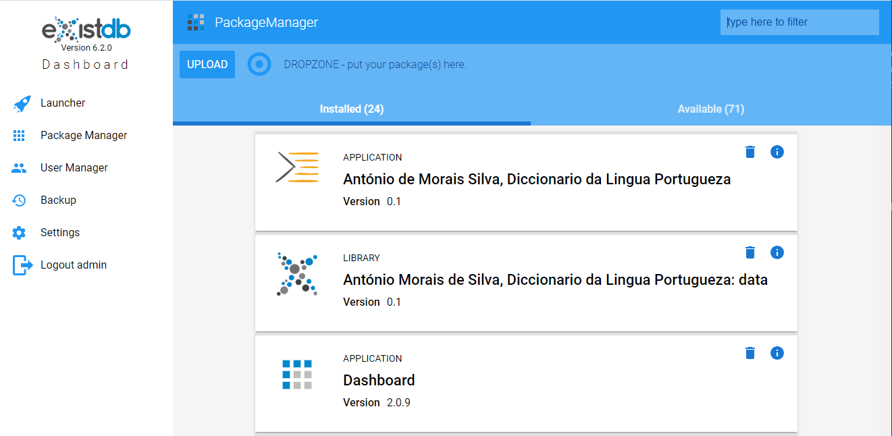

# MORDigital Data

Data repository for **MORDigital Data** application.

This application, an installable module for [eXist-db](https://exist-db.org/) database, contains basic structure for data: subdirectories `dictionaries` and `about` in the `data` directory. Furthermore it contains definition of indexes for searching and facets (`collection.xconf`) and a module in XQeury (`index-xql`) used in the process of indexing XML documents. There is also another module (`modules/report.xql`) witch retrieves metadata and data about defined search fields and facets and their content.

*MORDigital Data* module is used by **MORDigital Web Application** to store and deliver dictionary data.

## Instalation

### Prerequsities

- [eXist-db](https://exist-db.org)  [eXist-db 6.2.0](https://github.com/eXist-db/exist/releases/tag/eXist-6.2.0) or [later](https://github.com/eXist-db/exist/releases/latest)

You can follow instruction from the [TEI Publisher](https://github.com/eeditiones/tei-publisher-app#installation) repository.

A prebuilt version of the app can be downloaded from this [repository](/relases/latest) and installed.

### Installation with Package Manager

On your eXist-db instance, open the package manager in the dashboard and move downloaded **MORDigital Data** on the `DROPZONE - put your package(s) here.` text, or hit `Upload` button and select downloaded file from your local directory. This should automatically install dependencies such as the **TEI Publisher: Processing Model Libraries**.



After installing the **MORDigital Data** application an eXist-db library called *António Morais de Silva, Diccionario da Lingua Portugueza: data* will show in the *Package Manager*.

## Features

**MORDigital Data** library supports search in the following parts of TEI Lex-0 encoded dictionary:

### Fields

| Name | XPath | Note |
| ---- | ----- |----- |
|lemma|`form[@type='lemma']`||
|definition|`def`||
|example|`cit[@type='example']`||
|pos|`gram[@type='pos']`||
|gloss|`gloss`||

### Facets

| Name | XPath | Note |
| ---- | ----- |----- |
|dictionary|`title[@type='main']`||
|objectLanguage|`orth/@xml:lang`||
|pos|`gram[@type='pos']`||
|polysemy|`count(sense)`||
|entry-type|`entry/@type`||
|attitude|`usg[@type='attitude']`||
|domain|`usg[@type='domain']`||
|frequency|`usg[@type='frequency']`||
|geographic|`usg[@type='geographic']`||
|hint|`usg[@type='hint']`||
|meaningType|`usg[@type='meaningType']`||
|normativity|`usg[@type='normativity']`||
|socioCultural|`usg[@type='socioCultural']`||
|textType|`usg[@type='textType']`||
|time|`usg[@type='time']`||
|attestation|`bibl[@type='attestation']`||
|attestation-author|`bibl[@type='attestation']/author`||
|attestation-title|`bibl[@type=attestation]/title`||
|metamark|`metamark/@function`||

### Fileds used for the application functionality

| Name | XPath | Note |
| ---- | ----- |----- |
|sortKey|`entry/@sortKey`||
|letter|`head[@type='letter']`||
|chapter-id|`chapter/@xml:id`||
|chapter|`div[@type='letter']/@n`||


## Development

If you want change the name of this eXist-db module do it in this places:

- `repo.xml`
  - `<description>`
  - `<website>`
  - `<target>`
  - `<permissions>`
  - `<changelog>`
- `expath-pkg.xml`
  - `<package>`
    - @abbrev
    - @name
    - @version
  - `<title>`
  - `<home>`

## Useful scripts

The following scripts use the `xst` command line tool (<https://github.com/eXist-db/xst>) to manipulate your code, data and eXist-db modules.

To install `xst`, follow the [instructions](https://github.com/eXist-db/xst) on the GitHub project repository.

If the script has two versions, the first one - with the variable (`SET project=`) - can be used from the command line on Windows. The second one - with the full path instead of the parameter - can be used either from PowerShell or from the command line on Windows.

**If you want change the name of this eXist-db module** in the first version of the script set parameter value to the new name (without `-data` suffix), in the second version change the full name.

### Installing data module

#### Install

```script
SET project=mordigital
xst package install --config admin.xstrc ./build/%project%-data.xar
```

```script
xst package install --config admin.xstrc ./build/mordigital-data.xar
```

#### Uninstall

```script
SET project=mordigital
xst package uninstall --config admin.xstrc %project%-data
```

```script
xst package uninstall --config admin.xstrc mordigital-data
```

### Data

#### Uploading dictionary data

```script
SET project=mordigital
xst upload -i "*.xml" -v ../local/data/ /db/apps/%project%-data/data/dictionaries --config %project%.xstrc
xst upload -i "*.xml" -v ../local/data/latest/ /db/apps/%project%-data/data/dictionaries --config %project%.xstrc
```

```script
xst upload -i "*.xml" -v ../local/data/latest/ /db/apps/mordigital-data/data/dictionaries --config mordigital.xstrc
```

#### Deleting

```script
SET project=mordigital
xst remove /db/apps/%project%-data/data/dictionaries/*.xml --config %project%.xstrc
```

#### Uploading xconf data

```script
SET project=mordigital
xst upload --include "*.xconf" --verbose --apply-xconf ./data/dictionaries/ /db/apps/%project%-data/data/dictionaries --config admin.xstrc
```

```script
xst upload --include "*.xconf" --verbose --apply-xconf ./data/dictionaries/ /db/apps/mordigital-data/data/dictionaries --config admin.xstrc
```

#### Uploading index module

```script
SET project=mordigital
xst upload --include "index.xql" --verbose ./ /db/apps/%project%-data --config admin.xstrc
```

```script
xst upload --include "index.xql" --verbose ./ /db/apps/mordigital-data --config admin.xstrc
```

#### Reindex content

```script
SET project=mordigital
xst execute "xmldb:reindex('/db/apps/%project%-data/data/dictionaries')" --config admin.xstrc
```

```script
xst execute "xmldb:reindex('/db/apps/mordigital-data/data/dictionaries')" --config admin.xstrc
```
